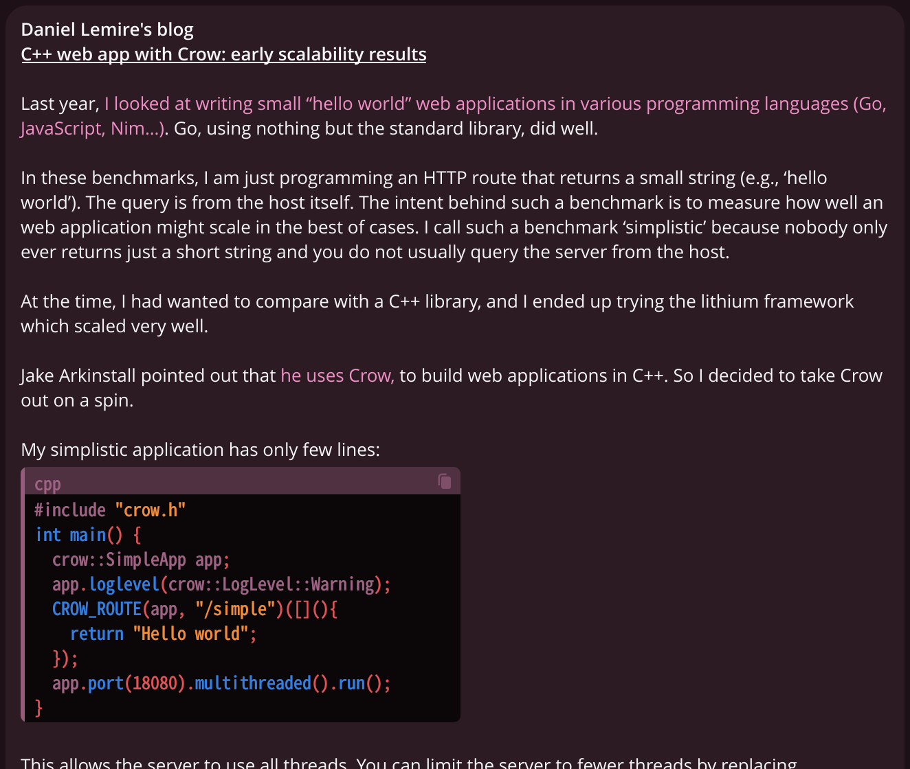
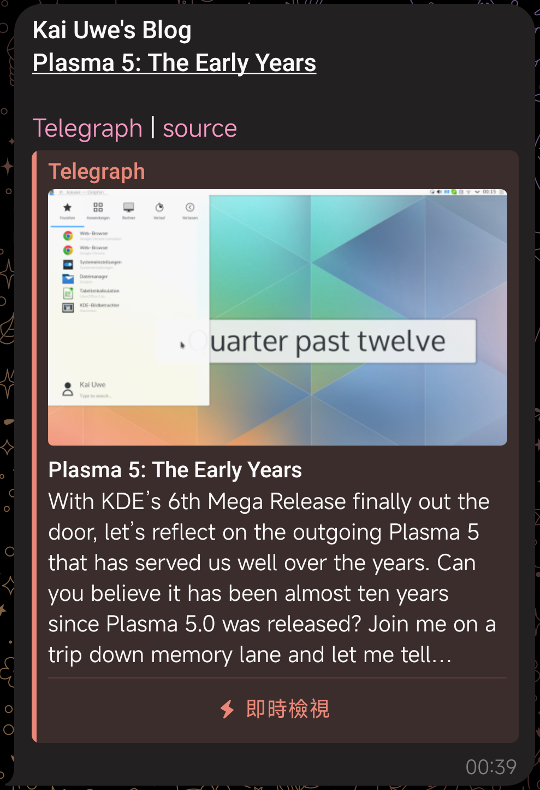
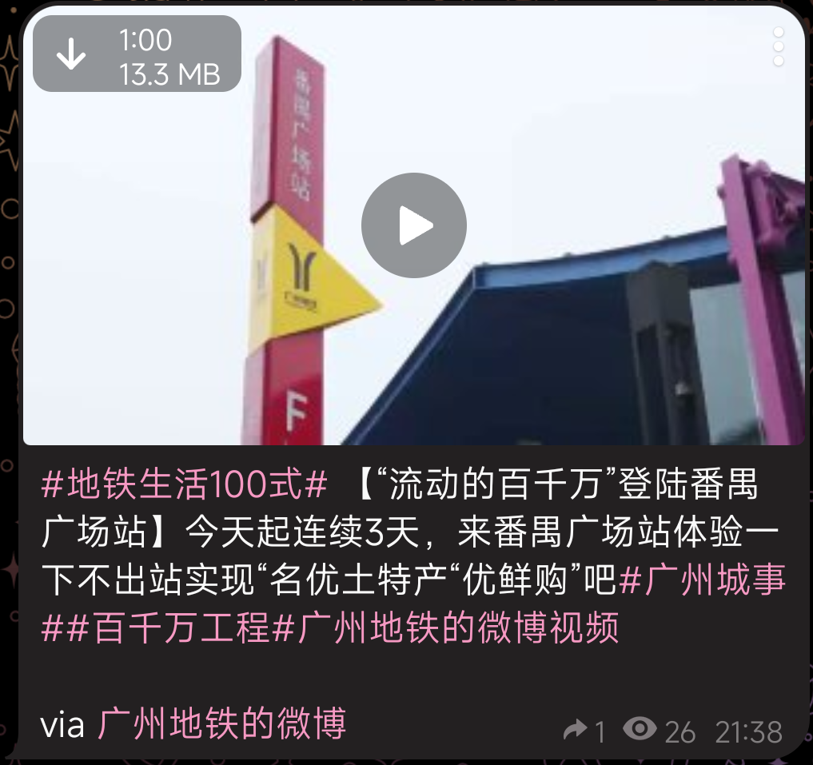

<h1 align="center">YemenHR RSS Bot</h1>

<b>A Telegram RSS bot for YemenHR job listings</b>

| [简体中文 README] | [CHANGELOG] | [FAQ] | [Documentation] | [YemenHR RSS Bot Channels] |
|:-------------:|:-----------:|:-----:|-----------------|:----------------------:|

[简体中文 README]: README.zh.md

[CHANGELOG]: docs/CHANGELOG.md

[FAQ]: docs/FAQ.md

[Documentation]: docs

[YemenHR RSS Bot Channels]: docs/channels-using-rsstt.md

<table>
    <tr>
        <td></td>
        <td rowspan="2"></td>
        <td rowspan="2"></td>
    </tr>
    <tr>
        <td></td>
    </tr>
</table>

## Highlights

- Multi-user
- I18n
    - English, Chinese, Cantonese, Italian, and [more](docs/translation-guide.md)!
- The content of the posts of an RSS feed will be sent to Telegram
    - Keep rich-text format
    - Keep media (customizable)
        - Images, Videos, and Audio both in the post content and enclosure; Documents in the post enclosure
        - Long images will be sent as files to prevent Telegram from compressing the image and making it unreadable
        - Drop annoying icons, they break the reading experience
    - Automatically replace emoji shortcodes with emoji
    - Automatically replace emoji images with emoji or its description text
    - Automatically determine whether the title of the RSS feed is auto-filled, if so, omit the title (customizable)
    - Automatically show the author-name (customizable)
    - Automatically split too-long messages
    - Messages can be sent as Telegraph posts (customizable)
    - Note: The author name and URL in generated Telegraph posts are hardcoded as "Generated by YemenHR RSS Bot" and "https://github.com/EngDawood/yemenhr-rss-bot" respectively
- [Various customizable formatting settings](docs/formatting-settings.md)
    - Hashtags, custom title, etc.
- Individual proxy settings for Telegram and RSS feeds
- OPML importing and exporting (keep custom title)
- Optimized performance (see also the [FAQ](docs/FAQ.md#q-how-is-the-performance-of-the-bot))
- User-friendly
- HTTP Caching
- Free and open source (AGPLv3+)
## Deployment

\

[&logo=docker)](https://github.com/EngDawood/yemenhr-rss-bot/actions/workflows/publish-docker-image.yml?query=branch%3Adev)

\

[&logo=pypi&logoColor=white)](https://github.com/EngDawood/yemenhr-rss-bot/actions/workflows/publish-to-test-pypi.yml)

It is quite easy to deploy your YemenHR RSS Bot instance. The most recommended way to deploy it is Docker Compose: it is suitable for virtually all VPS. You may also install it from [PyPI](https://pypi.org/project/rsstt/) (tracking `master` branch) or [TestPyPI](https://test.pypi.org/project/rsstt/) (tracking `dev` branch, which is always up-to-date) using pip. For developers or experienced users, dirty run from source is also an option.

For more details, refer to the [deployment guide](docs/deployment-guide.md).

## Supabase PostgreSQL Database Setup

This project has been configured to use Supabase as the primary PostgreSQL database. The local PostgreSQL container has been removed in favor of the managed Supabase database service. See [SUPABASE_SETUP.md](SUPABASE_SETUP.md) for the original local setup instructions, or refer to [Supabase Configuration Documentation](docs/supabase-configuration.md) for details on the current Supabase setup.

## Translation

Read the translation guide [here](docs/translation-guide.md).

You can help to translate the bot using [Hosted Weblate](https://hosted.weblate.org/projects/rss-to-telegram-bot/). Special thanks to their free hosting service for libre projects!

## Using the public bot

The [public bot](https://t.me/YemenHR_Bot) comes with absolutely no warranty. I will try my best to maintain it, but I cannot guarantee that it will always work perfectly. Meanwhile, you should "fair use" the bot, avoid subscribing to too many RSS feeds.\
If you use the [public bot](https://t.me/YemenHR_Bot) in your Channel, consider mentioning the bot (or this project) in your channel description (or pinned message) to let more people know about it. That's not a compulsion.

## Known channels using YemenHR RSS Bot

Want to preview what the messages sent by YemenHR RSS Bot look like? Here is a [list of channels using it](docs/channels-using-rsstt.md).

## Licensing

This project is licensed under [AGPLv3+](LICENSE). Closed-source distribution or bot-hosting are strictly prohibited. If you distribute or host it with code modifications, make sure the source code is available to anyone who can use the bot (by editing the repo URL in [`src/i18n/__init__.py`](src/i18n/__init__.py)).

    RSS to Telegram Bot
    Copyright (C) 2020-2024  Rongrong <i@rong.moe>

    This program is free software: you can redistribute it and/or modify
    it under the terms of the GNU Affero General Public License as
    published by the Free Software Foundation, either version 3 of the
    License, or (at your option) any later version.

    This program is distributed in the hope that it will be useful,
    but WITHOUT ANY WARRANTY; without even the implied warranty of
    MERCHANTABILITY or FITNESS FOR A PARTICULAR PURPOSE.  See the
    GNU Affero General Public License for more details.

    You should have received a copy of the GNU Affero General Public License
    along with this program.  If not, see <https://www.gnu.org/licenses/>.

The repository was forked from [Rongronggg9/RSS-to-Telegram-Bot](https://github.com/Rongronggg9/RSS-to-Telegram-Bot) in 2025. 

Join Us